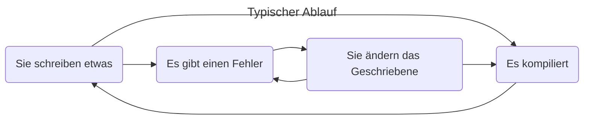

# MIDI Anwendung

In der aktuellen Abgabe sollen Sie einen minimalen MIDI-Generator bauen.
Es scheint, als ob ein derart simples Programm komplett nutzlos wäre.
Allerdings erforschen Komponisten bereits seit Mitte der Sechzigerjahre, wenn nicht noch viel Länger, wie man Musik mit minimalen Mitteln erzeugen kann.

Steve Reich, einer der wegweisenden Vertreter der Minimalmusik, schrieb z.B. die Stücke [Clapping Music](https://youtu.be/YPU5XrmORCQ) und [Piano Phase](https://youtu.be/Jqoieg0Vqag), die trotz minimaler, repetitiver Struktur einen beeindruckenden Effekt erzielen.

Beide Stücke können nach kleinen Erweiterungen leicht mit Ihrem MIDI-Programm generiert werden.

Zusätzlich zur Abgabe sei Ihnen also die Implementation beider Stücke als Fingerübung ans Herz gelegt!
Wer diese Stücke generiert, die entsprechenden Dateien abgibt und mir, erklären kann wie diese funktionieren, ist automatisch zur Abschlussprüfung zugelassen und bekommt 10% Bonus auf die Punkte.
Die geforderten Dateien umfassen MIDI und Code und die Gesamtzahl der zu erreichenden Punkte ist auf 100% limitiert.
Z.B. 95% der Punkte + Bonus = 100% und 0% der Punkte + Bonus = 10%.

Die Stücke verwenden ähnliche, aber leicht unterschiedliche Techniken, welche im Folgenden beschrieben sind.

## Clapping Music

In Clapping Music spielen zwei Stimmen dieselbe simple Figur, aber verschieben sich alle paar Takte gegeneinander.

Es handelt sich um den folgenden Rythmus im $\frac{12}{8}$ Takt: `xxx-xx-x-xx-`.
Hierbei steht `x` für ein Klatschen und `-` für eine Pause.

Die erste Stimme spielt den Rythmus durchgehend, während die zweite Stimme in jedem vierten Takt um ein Achtel verschiebt.
Nach vier Takten spielt Stimme zwei also den $\frac{12}{8}$ Takt `xx-xx-x-xx-x`, nach acht `x-xx-x-xx-xx`, usw.

Gucken Sie sich zum besseren Verständnis auch diese [Visualisierung von Clapping Music](https://youtu.be/YPU5XrmORCQ) (YouTube), oder den [Wikipedia Artikel](https://en.wikipedia.org/wiki/Clapping_Music) an.

## Piano Phase

Auch in Piano Phase verschieben wir zwei Stimmen gegeneinander, um einen [Phasing-Effekt](https://en.wikipedia.org/wiki/Phase_music) zu generieren.
Allerdings lässt die zweite Stimme keine Schläge aus, sondern spielt hier über manche Strecken in einem etwas anderen Tempo.
Dabei ensteht eine einzelne Melodie, die zunächst zu verschwimmen scheint, nur um anschließend in zwei scharf trennbare Stimmen zu zerfallen.
Dieser Vorgang wiederholt sich mehrfach, wodurch alle paar Takte verschiedene Kontrapunkte entstehen, die kurz darauf wieder zerfallen, nur um von der nächsten Variation ersetzt zu werden.

Die ersten vier bis acht Takte spielt der erste Pianist alleine und erst dann setzt der zweite Pianist ein.
Das Grundmotiv besteht aus den Sechzentelnoten E4, F#4, B4, C#5, D5, F#4, E4, C#5, B4, F#4, D5, C#5.

Der zweite Pianist beginnt leise und spielt zunächst im selben Tempo, wobei er über die nächsten 12 bis 18 Takte langsam lauter wird.
Nach diesen 12 bis 18 Takten spielt das zweite Piano über die nächsten Takte etwas schneller, bis sich beide Stimmen nach vier bis 16 Takten um genau eine Note verschoben haben.
Sobald beide Stimmen synchron sind, wird das Tempo für die nächsten 16 bis 24 Takte gehalten.

Dieses Muster von 4 bis 16 Takten Beschleunigung und 16 bis 24 Takten Synchronität wiederholt sich, bis beide Stimmen wieder unisono spielen.

Genaue Instruktionen finden Sie [im Internet](https://www.ciufo.org/classes/sonicart_sp09/readings/SteveReich-PianoPhase.pdf).

Gucken Sie sich zum besseren Verständnis auch diese [Visualisierung von Piano Phase](https://youtu.be/Jqoieg0Vqag) (YouTube), oder den [Wikipedia Artikel](https://en.wikipedia.org/wiki/Piano_Phase) an.

## Allgemeines Vorgehen

Beim Programmieren kommt es häufig zu folgendem Ablauf:

Stellen Sie sicher, dass Sie **Fehlermeldungen** die Sie bekommen **lesen und verstehen**!
Sie können auch Google/ChatGPT benutzen um die Bedeutung der Fehlermeldung herauszufinden.
Bei der Nutzung von AI-Assistenten ist es wichtig, dass Sie nicht einfach ungeprüft übernehmen, sondern zunächst verstehen warum diese Antwort Sinn macht (oder auch nicht).

## Übersicht

Hier nochmal eine Übersicht relevanter Informationen und Ressourcen.

- Was sollen Sie machen?
    - MIDI-Dateien für beide Stücke generieren.
    - MIDI und Code abgeben und erklären.
- Was müssen Sie dafür können?
    - Sie müssen in beiden Stücken mehrere Stimmen nebeneinander kontrollieren.
      Das sollte innerhalb eines Channels möglich sein, aberwahrscheinlich macht es hier Sinn, mehr als einen Channel anzusteuern, damit die Logik nicht übermäßig kompliziert wird.
    - In Piano Phase müssen Sie die Geschwindigkeit der einen Stimme anpassen.
      Dies erfordert zusätzliche Logik um das Timing zu kontrollieren.
- Wo bekommen Sie die notwendigen Informationen für die Implementation her?
    - Die [Spezifikation](https://www.cs.cmu.edu/~music/cmsip/readings/Standard-MIDI-file-format-updated.pdf) des MIDI-Dateiformats.
    - Mit einem Programm wie z.B. [`fluidsynth`](https://www.fluidsynth.org/) können Sie die generierten Daten prüfen.
    - Nützlich könnten u.a. auch folgende Soundfonts sein:
        - [AI Basic Drums](https://musical-artifacts.com/artifacts/3832)
        - [Casio CTK-533 Piano](https://musical-artifacts.com/artifacts/1790)
- Was bekommen Sie dafür?
    - Automatische Zulassung zur Abschlussaufgabe.
    - Bis zu[^max100] 10% Bonuspunkte in der Abschlussaufgabe.

[^max100]: Die Punkte in der Abschlussaufgabe sind auf 100% limitiert.
